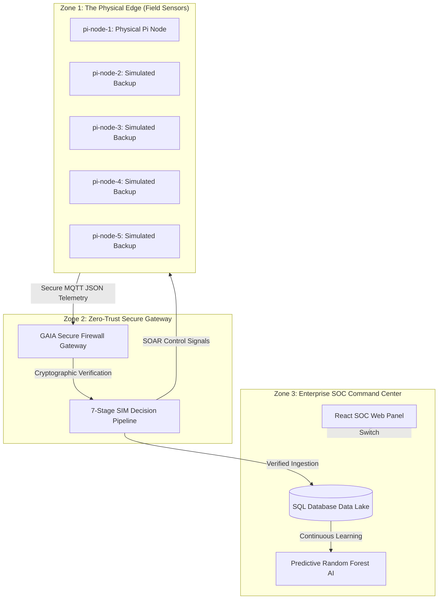

# 🌍 Project GAIA: Secure, Zero-Trust AI-Powered Geotechnical IoT Platform

> **Predictive Natural Disaster Modeling meets Autonomous Cyber-Defense Security.**

Project GAIA is a secure, industrial-grade IoT platform built to address two critical challenges of modern environmental sensor networks: **accurate real-time prediction of natural disasters (landslides)** and **autonomous cyber-defense (SOAR) at the edge** to secure exposed sensor hardware against data poisoning, spoofing, and DDoS flooding attacks.

Unlike passive data monitoring pipelines, GAIA features a **Zero-Trust Security Integrity Module (SIM)** gateway that autonomously isolates compromised sensors and forces attacker hosts to self-terminate without human intervention.

---

## 📸 System Architecture & Data Flow

GAIA operates on a logical **Three-Zone Topology** that guarantees data integrity and network resilience:



---

## 📈 The Problem Statement & Industry Context

### The Challenge of Geotechnical Edge Sensors
Landslide-prone hillsides are highly remote, requiring battery-powered telemetry hardware scattered across rough terrain. In typical deployments, these nodes transmit parameters like moisture, structural tilt, vibration, and temperature back to centralized civil defense control rooms. 

However, because these devices are physically isolated in the wild, they are highly vulnerable to:
1. **Physical Casing Tampering:** Attackers physically opening casing lids to inject signals directly onto pins.
2. **Data Ingestion Poisoning:** Artificially spoofing environmental variables (e.g., feeding $999^\circ\text{C}$ temperature or negative moisture levels) to crash backend ML models, render prediction metrics useless, or cause costly civil defense panic/evacuations.
3. **Identity Spoofing:** Mimicking authorized sensor identifiers to transmit false readings from unauthenticated malicious devices.
4. **DDoS Ingestion Flooding:** Bombarding open telemetry endpoints to saturate systems, preventing real-time landslide warnings from getting through.

### Comparison: GAIA vs. Traditional Existing Systems

| Feature | Traditional Geotechnical Systems (e.g., Campbell Scientific, Worldsensing, RST Instruments) | Standard IoT Security Frameworks (e.g., general-purpose firewalls like Fortinet / Palo Alto Networks) | Project GAIA (AI-Powered Zero-Trust SOAR Platform) |
| :--- | :--- | :--- | :--- |
| **Telemetry Ingestion** | Static, scheduled telemetry uploads (primarily offline or batch). | Stream ingestion at the packet level. | **High-frequency real-time streams** with live sub-second visual socket updates. |
| **Landslide Prediction** | Static triggers (e.g., moisture > 60% triggers alarm). Lacks dynamic multi-class classification. | None. General network security only. | **Dynamic Random Forest Machine Learning Engine** mapping multi-dimensional arrays `[moisture, shake, tilt, temp]` to weighted hazard probabilities ($0\% - 100\%$). |
| **Physical Tamper Interception** | Local logging only; does not affect ingestion databases in real-time. | None. | **Sub-0.5s local hardware lid interrupts** immediately quarantining the node at the database boundary. |
| **Data Poisoning Prevention** | Discards out-of-bounds metrics locally but is highly vulnerable to network-spoofed out-of-bounds REST payloads. | Block general malformed HTTP packets; blind to physical sensor domain logic (e.g. impossible moistures). | **Gateway-level domain inspection** blocking impossible ranges (e.g. moisture $<0\%$ or $>100\%$, tilt out of range $[-180^\circ, 180^\circ]$) at the Ingestion edge. |
| **Active Remediation (SOAR)** | Manual intervention required. Node continues reporting until field technicians physically visit the site. | Simple IP blacklisting. Node continues flooding local interfaces. | **Active Feedback Containment:** Isolates nodes, bans IPs, broadcasts `"BLOCKED"` MQTT alert sirens, and forces attacking scripts to autonomously self-destruct (`sys.exit(0)`). |
| **Timezone Synchronization** | Prone to standard 5.5-hour UTC timezone drift (creating mismatched telemetry charts on Indian Standard Time laptops). | Ignored (standardized to local system clock). | **Universal Localized Timezone Correction:** Standardizes database transactions to UTC globally, dynamically computing offsets in the browser layer (e.g., IST) for real-time visualization. |

---

## ⚡ Key Innovations & Solved Challenges

### 🧠 1. Predictive Landslide AI (Scikit-Learn Random Forest)
*   **Machine Learning Core:** Uses a multi-class **Random Forest Classifier** trained on high-fidelity features: `[moisture, vibration/shake, absolute tilt, temperature]`.
*   **Dynamic Probability Scoring:** Computes dynamic probability weights ($0\%$ to $100\%$) to generate a weighted risk score instead of relying on static thresholds:
    $$\text{Risk Score} = (P(\text{WARNING}) \times 50) + (P(\text{LANDSLIDE RISK}) \times 100)$$
*   **Autonomous Remediation:** Translates risk levels directly to actionable emergency behaviors:
    *   `SAFE` $\rightarrow$ Nominal environmental monitoring. Green LED backlit status on physical node LCD.
    *   `WARNING` $\rightarrow$ Increases edge reporting frequencies, alerts emergency contact groups. Orange backlit status.
    *   `LANDSLIDE RISK` $\rightarrow$ Instantly flashes sirens and triggers visual strobe alerts for local evacuations. Red backlit status and pulsing passive buzzer alarm.

### 🛡️ 2. Zero-Trust Cyber Security Integrity Module (SIM Engine)
Implements a strict **7-Stage SOAR Decision Pipeline** (Ingest, Enrich, Detect, Analyze, Contain, Eradicate, Recover) to intercept edge anomalies:
*   **DDoS Flooding Mitigation:** Rate limits nodes. If requests exceed 20 packets per 10 seconds, the IP is blacklisted, and the node is isolated.
*   **Node Identity Spoofing Protection:** Validates cryptographic API keys against expected node identifiers. An identity mismatch triggers instant firewall isolation.
*   **Physical Tamper Interception:** Detects hardware lid switches. A breach event triggers a high-priority sub-0.5s quarantine command.
*   **Data Poisoning Prevention:** Discards physically impossible ranges (e.g., moisture > 100%, tilt > 180°), quarantining the node at the database border.

### 🤖 3. Fully Autonomous Containment Loop
*   Once an attack is identified, the backend gateway blocks the attacker's IP and changes the sensor's status to `"isolated"`.
*   It responds to the attacking client with a `403 Forbidden: Node ISOLATED` signal.
*   The attacker simulator script (`mitm_attack.py`) intercepts this blocked state and **safely terminates execution autonomously (`sys.exit(0)`)**, simulating remote eradication of the hacker's server.
*   The gateway simultaneously broadcasts a `"BLOCKED"` MQTT signal to the Pi, triggering local strobe lights and buzzers.

### 🕒 4. Universal Browser Timezone Alignment (IST Conversion)
*   Solves the 5.5-hour UTC timezone drift. Telemetry is saved in standardized UTC globally. The frontend automatically parses naive datetimes and converts them dynamically to the **user's local browser timezone (e.g. Indian Standard Time - IST)**, ensuring real-time chart and log consistency.

---

## 🛠️ Step-by-Step System Working Algorithm

```
                  ┌──────────────────────────────┐
                  │ 1. Physical Node Power-On    │
                  │  - Setup GPIO registers      │
                  │  - Pull down Lid Tamper switch│
                  └──────────────┬───────────────┘
                                 │
                  ┌──────────────▼───────────────┐
                  │ 2. Edge Auto-Calibration      │
                  │  - Establish sensor baselines │
                  │  - LCD displays "SECURE" (Grn)│
                  └──────────────┬───────────────┘
                                 │
                  ┌──────────────▼───────────────┐
                  │ 3. Continuous Edge Polling   │
                  │  - Poll data every 10ms      │
                  │  - Tamper? Instant interrupt │
                  └──────────────┬───────────────┘
                                 │
                  ┌──────────────▼───────────────┐
                  │ 4. Telemetry Stream Upload   │
                  │  - HTTP POST or MQTT JSON    │
                  │  - Package key, ID, metrics  │
                  └──────────────┬───────────────┘
                                 │
         ┌───────────────────────▼───────────────────────┐
         │ 5. Ingestion Gateway Security (7-Stage SIM)    │
         │  - IP Block Check (Auto-Recover if > 30s)     │
         │  - Rate Limiting (Max 20 req/10s)             │
         │  - Cryptographic API Key Verification         │
         │  - Identity Spoofing Cross-Reference          │
         │  - Sensor Range Logic (Data Poisoning Check)  │
         │  - Casing Lid Open Switch Assessment          │
         └───────────────────────┬───────────────────────┘
                                 │
             ┌───────────────────┴───────────────────┐
             ▼ Allowed                               ▼ Malicious (Intrusion Caught!)
┌───────────────────────────────┐         ┌─────────────────────────────────┐
│ 6. Predictive Landslide ML    │         │ A. Database Isolation           │
│  - RandomForest Classifier    │         │  - Log INGEST to RECOVER stages │
│  - Compute Weighted Risk      │         │  - Add origin IP to BlockedIP   │
│  - Predict Class (SAFE/WARN/  │         │  - Node Status = "isolated"     │
│    LANDSLIDE RISK)            │         └────────────────┬────────────────┘
└────────────┬──────────────────┘                          │
             │                            ┌────────────────▼────────────────┐
┌────────────▼──────────────────┐         │ B. Actuate Local Hardware Alarms│
│ 7. Database Ingestion         │         │  - Publish MQTT "BLOCKED" signal│
│  - Write telemetry record     │         │  - LED White Strobe ON          │
│  - Update node 'last_seen'    │         │  - PWM Loud Buzzer Alert ON     │
│                               │         │  - Display "QUARANTINE" on LCD  │
└────────────┬──────────────────┘         └────────────────┬────────────────┘
             │                                             │
┌────────────▼──────────────────┐         ┌────────────────▼────────────────┐
│ 8. Real-time SOC Panel Sync   │         │ C. Return 403 Forbidden Response│
│  - Pushes metrics via Socket  │         │  - Payload: "Node ISOLATED"     │
│  - UI parses times to IST     │         └────────────────┬────────────────┘
└────────────┬──────────────────┘                                 │
             │                                                    │
┌────────────▼──────────────────┐         ┌───────────────────────▼─────────┐
│ 9. Publish Alert back to Node │         │ D. Attacker Self-Termination    │
│  - Publish Severity via MQTT  │         │  - Intercepts 403 response      │
│  - Actuate local LED/Buzzer   │         │  - Autonomous sys.exit(0) trigger│
└───────────────────────────────┘         └─────────────────────────────────┘
```

## 📂 Codebase Structure

```
├── /backend
│   ├── /app
│   │   ├── /engines
│   │   │   ├── landslide_ai.py  # Random Forest ML predictor & training
│   │   │   └── security_ai.py   # 7-stage SIM security pipeline, IP blocks
│   │   ├── /routers
│   │   │   ├── sensors.py       # REST listener for edge telemetry & interrupts
│   │   │   └── dashboard.py     # Ingestion stats, seeders, manual isolate/recover
│   │   ├── models.py            # SQLite/PostgreSQL Database ORM schemas
│   │   ├── schemas.py           # Pydantic validation schemas
│   │   ├── database.py          # Session configuration & Engine
│   │   ├── email_service.py     # Alerts dispatcher
│   │   ├── mqtt_client.py       # Paho MQTT Client thread startup
│   │   └── main.py              # FastAPI application, CORS, Startup hooks
│   ├── requirements.txt         # Core dependencies (fastapi, scikit-learn, paho-mqtt)
│   ├── Dockerfile               # Microservices deployment configuration
│   └── Procfile                 # Production environment process map
├── /frontend
│   ├── /src
│   │   ├── /pages
│   │   │   ├── Dashboard.jsx    # Real-time dials, gauges, and hazard logs
│   │   │   ├── ThreatIntelligence.jsx # Dynamic HSL Cyber Threat Topology Map
│   │   │   ├── NodeNetwork.jsx  # 5-node enterprise map & admin controls
│   │   │   └── DataLake.jsx     # Telemetry database SQL query console
│   │   ├── App.jsx              # Main routing and navigation
│   │   └── index.css            # Cyberpunk aesthetic theme stylesheet
├── /pi-client
│   ├── real_pi_node.py          # Physical RPi controller with GPIO and RGB LCD
│   └── pi_node.py               # REST fallback simulation node script
├── /simulators
│   └── pi_node.py               # Multi-node network simulator script
└── /attacker-simulator
    └── mitm_attack.py           # Self-terminating exploit simulator script
```

---

## 🚀 Installation & Setup Guide

### 1. Backend Setup (FastAPI + SQL Database)
1. Navigate to the backend folder:
   ```bash
   cd backend
   ```
2. Install the required Python dependencies:
   ```bash
   pip install -r requirements.txt
   ```
3. Start the local development server:
   ```bash
   uvicorn app.main:app --reload --port 8000
   ```
   *   **Swagger API Documentation Panel:** Automatically available live at `http://127.0.0.1:8000/docs`. Verify endpoint connections here!

### 2. Frontend Setup (React + Vite)
1. Navigate to the frontend folder:
   ```bash
   cd frontend
   ```
2. Install node dependencies:
   ```bash
   npm install
   ```
3. Boot the local dashboard server:
   ```bash
   npm run dev
   ```
   *   Open your browser to the local address displayed (usually `http://localhost:5173`).

### 3. Running the Edge Raspberry Pi Node
If deploying on a physical Raspberry Pi:
1. Wire up the physical sensors:
   *   Moisture Sensor (YL-69/HL-69 resistive) on Pin `17`.
   *   Vibration Sensor (SW-420) on Pin `27`.
   *   PIR Motion Sensor (HC-SR501) on Pin `22`.
   *   Lid Casing Tamper switch on Pin `26`.
   *   Green LED on Pin `13` (SAFE).
   *   Blue LED on Pin `12` (WARNING / LANDSLIDE RISK).
   *   White LED on Pin `18` (DANGER / STROBE).
   *   Passive Buzzer on Pin `25`.
   *   DFRobot LCD1602 RGB screen on `I2C` pins.
2. Execute the edge client:
   ```bash
   python pi-client/real_pi_node.py
   ```

### 4. Running the Multi-Node Simulator
To test the 5-node enterprise setup without physical Pi hardware:
1. Run the simulator script:
   ```bash
   python simulators/pi_node.py
   ```

### 5. Running the Attacker Exploit Simulation
To test the autonomous SOAR defense loop:
1. Boot up the backend and frontend.
2. Run the attacker script:
   ```bash
   python attacker-simulator/mitm_attack.py
   ```
3. **Observe the Magic:** The script will launch the flooding/poisoning attack, the gateway will instantly isolate the target node, and the script will automatically disconnect and self-terminate. The frontend Threat Map will visually sever the connection path in real-time!

---

## 👥 Authors & Contributors

*   **Syed Ather Ali** 
*   **Mohd Shahed Ali**
*   **Mohd Abdul Adnan Khan**
---

## 🏆 Project Accomplishments Summary
*   **100% Autonomous Remediation:** Remote exploits automatically cause targeted hacker scripts to disconnect and exit.
*   **IST Timezone Alignment:** Real-time logging matching the localized laptop clock.
*   **Scale-Up Ready:** Fully handles a multi-node enterprise environment with modular status reporting.
*   **Interactive Visualizations:** Premium CSS/SVG Logical cyber threat mapping displaying active laser routes and isolated containment lines.
